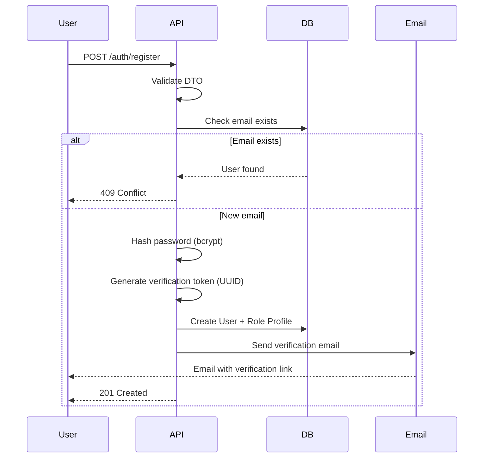
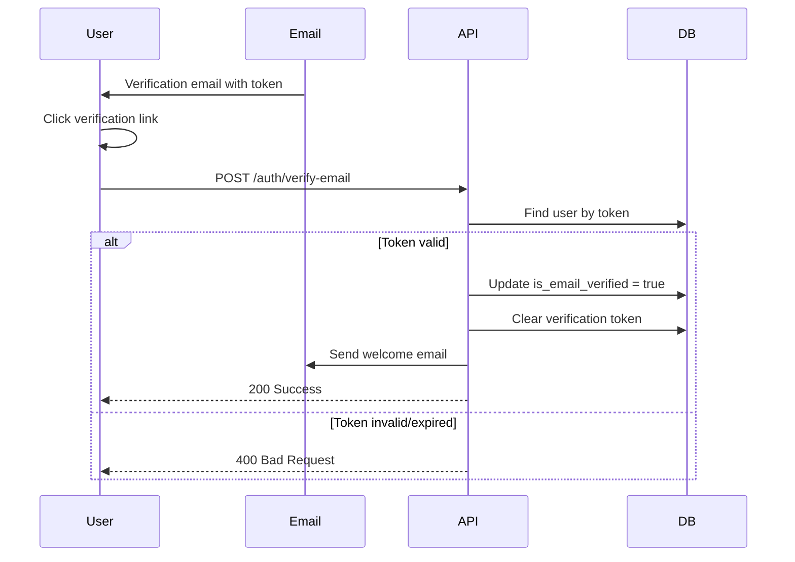
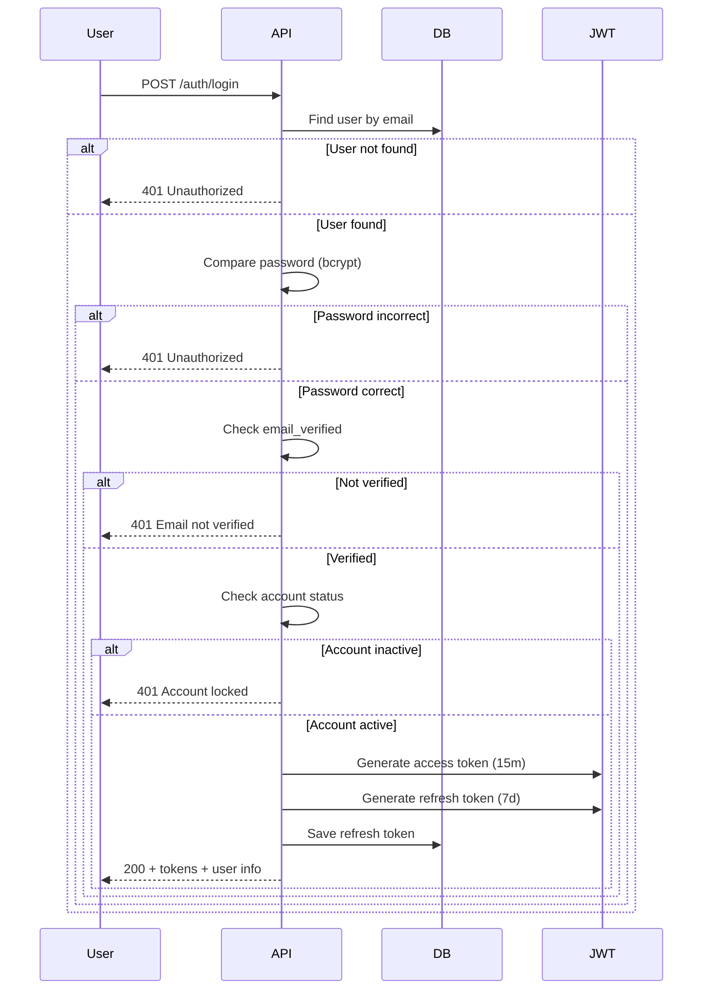
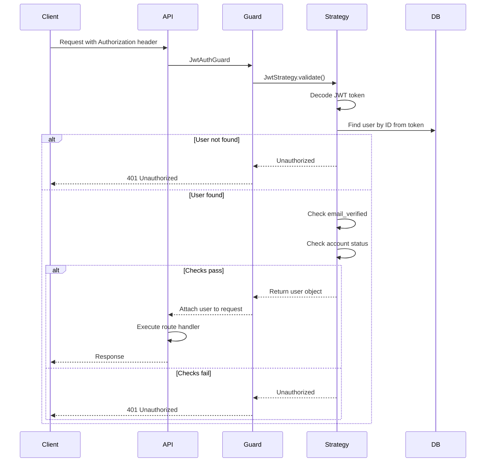
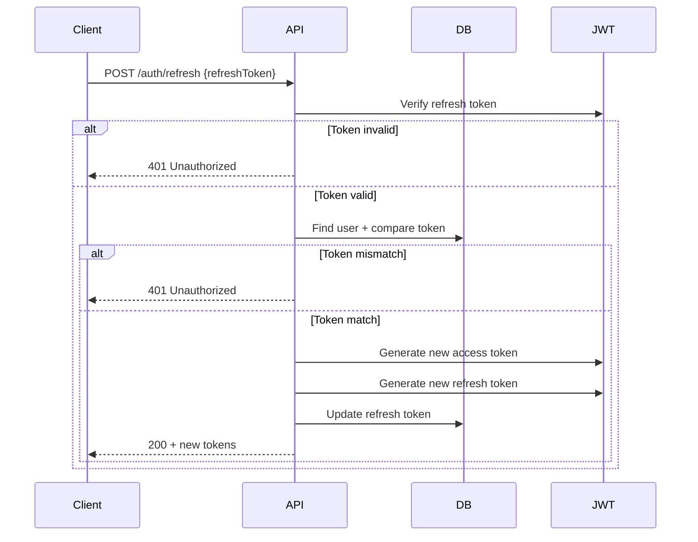
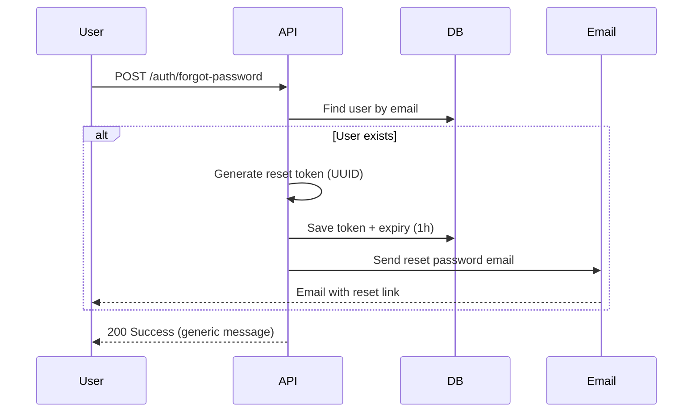
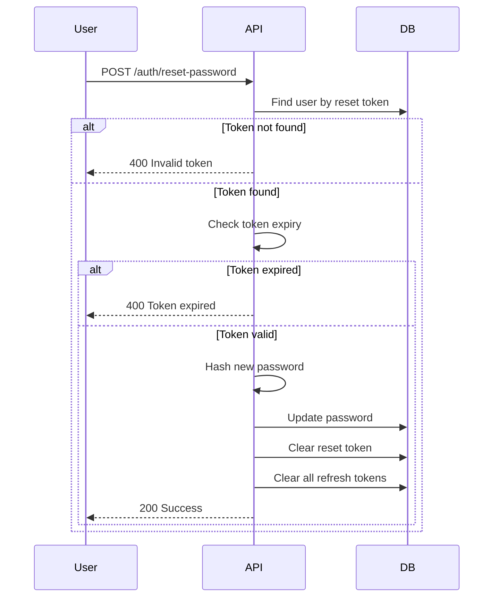

# 🏗️ Kiến trúc Hệ thống Authentication - CareerVibe

## 📊 Tổng quan Công nghệ

### Core Technologies Stack

| Công nghệ | Phiên bản | Mục đích |
|-----------|-----------|----------|
| **NestJS** | 11.x | Backend Framework |
| **TypeScript** | 5.x | Programming Language |
| **PostgreSQL** | 15.x | Database |
| **TypeORM** | 0.3.x | ORM |
| **JWT** | - | Token-based Authentication |
| **Passport** | - | Authentication Middleware |
| **Bcrypt** | - | Password Hashing |
| **Nodemailer** | - | Email Service |

---

## 🔐 Authentication Packages

### 1. **@nestjs/jwt** 
- **Chức năng**: JWT token generation và validation
- **Sử dụng**: Tạo access token và refresh token

### 2. **@nestjs/passport**
- **Chức năng**: Integration Passport.js với NestJS
- **Sử dụng**: Middleware authentication

### 3. **passport-jwt**
- **Chức năng**: JWT authentication strategy
- **Sử dụng**: Validate JWT tokens trong requests

### 4. **passport-local**
- **Chức năng**: Local authentication strategy
- **Sử dụng**: Authenticate với username/password

### 5. **bcrypt**
- **Chức năng**: Password hashing
- **Sử dụng**: Hash password trước khi lưu DB, compare khi login
- **Security**: Salt rounds = 10

### 6. **@nestjs-modules/mailer**
- **Chức năng**: Email service integration
- **Sử dụng**: Gửi email verification, password reset

### 7. **nodemailer**
- **Chức năng**: Email transport
- **Sử dụng**: SMTP client để gửi emails
- **Cấu hình**: Gmail SMTP (smtp.gmail.com:587)

### 8. **uuid**
- **Chức năng**: Generate unique tokens
- **Sử dụng**: Email verification token, password reset token

### 9. **class-validator & class-transformer**
- **Chức năng**: DTO validation
- **Sử dụng**: Validate input data

---

## 🎯 Luồng hoạt động (Flows)

### 1️⃣ Registration Flow



**Chi tiết:**
1. User gửi thông tin đăng ký
2. Validate dữ liệu đầu vào (DTO)
3. Kiểm tra email đã tồn tại chưa
4. Hash password với bcrypt (salt rounds: 10)
5. Tạo email verification token (UUID v4)
6. Lưu user vào database
7. Tạo profile theo role (JobSeeker/Employer/Admin)
8. Gửi email xác thực
9. Trả về response cho client

---

### 2️⃣ Email Verification Flow



**Chi tiết:**
1. User nhận email và click vào link verification
2. Frontend gửi token đến API
3. Tìm user theo token
4. Kiểm tra token có hợp lệ và chưa hết hạn (24h)
5. Cập nhật `is_email_verified = true`
6. Xóa token khỏi database
7. Gửi welcome email
8. User có thể đăng nhập

---

### 3️⃣ Login Flow



**Chi tiết:**
1. User gửi email + password
2. Tìm user trong database
3. So sánh password với bcrypt.compare()
4. Kiểm tra email đã verify chưa
5. Kiểm tra trạng thái tài khoản (ACTIVE)
6. Generate JWT tokens:
   - Access token: 15 phút
   - Refresh token: 7 ngày
7. Lưu refresh token vào database
8. Trả về tokens + user info

---

### 4️⃣ JWT Authentication Flow



**Chi tiết:**
1. Client gửi request với `Authorization: Bearer {token}`
2. JwtAuthGuard intercept request
3. JwtStrategy decode và validate token
4. Extract user ID từ token payload
5. Tìm user trong database
6. Kiểm tra email verified và account status
7. Attach user object vào request
8. Route handler có thể access user qua `@GetUser()` decorator

---

### 5️⃣ Refresh Token Flow



**Chi tiết:**
1. Client gửi refresh token (khi access token hết hạn)
2. Verify refresh token signature
3. Tìm user và compare refresh token trong DB
4. Generate tokens mới
5. Update refresh token trong database (token rotation)
6. Trả về tokens mới

---

### 6️⃣ Forgot Password Flow



**Chi tiết:**
1. User nhập email
2. Tìm user (không tiết lộ user có tồn tại hay không)
3. Generate password reset token (UUID)
4. Set expiry time: 1 giờ
5. Lưu token vào database
6. Gửi email với reset link
7. Trả về generic message (bảo mật)

---

### 7️⃣ Reset Password Flow



**Chi tiết:**
1. User gửi reset token + password mới
2. Tìm user theo token
3. Kiểm tra token chưa hết hạn (1h)
4. Hash password mới
5. Cập nhật password
6. Xóa reset token
7. Invalidate tất cả refresh tokens (force logout all devices)

---

## 🛡️ Security Layers

### Layer 1: Input Validation
- **class-validator**: Validate DTO
- **class-transformer**: Transform và sanitize data

### Layer 2: Password Security
- **bcrypt**: Hash với salt rounds = 10
- **Password policy**: Min 8 chars, complex pattern

### Layer 3: Token Security
- **JWT**: Signed tokens với secret key
- **Short-lived access tokens**: 15 phút
- **Refresh token rotation**: Mới mỗi lần refresh

### Layer 4: Email Verification
- **Mandatory verification**: Bắt buộc verify email
- **Time-limited tokens**: 24h cho verification, 1h cho reset

### Layer 5: Guards & Strategies
- **JwtAuthGuard**: Protect routes
- **RolesGuard**: Role-based access control
- **Passport Strategies**: Multiple authentication methods

---

## 📧 Email Service Architecture

### Email Types

1. **Verification Email**
   - Trigger: Sau khi đăng ký
   - Token expiry: 24 giờ
   - Template: HTML với button CTA

2. **Welcome Email**
   - Trigger: Sau khi verify email thành công
   - Content: Hướng dẫn sử dụng theo role

3. **Password Reset Email**
   - Trigger: Forgot password request
   - Token expiry: 1 giờ
   - Template: Warning-style email

### Email Configuration

```typescript
Transport: SMTP
Host: smtp.gmail.com
Port: 587
Secure: false (STARTTLS)
Auth: App-specific password
```

---

## 🗄️ Database Schema

### Users Table (Extended)

```sql
users
├── user_id (PK)
├── email (UNIQUE)
├── password_hash
├── full_name
├── phone
├── status (ENUM: ACTIVE, INACTIVE, BANNED)
├── is_email_verified (BOOLEAN)
├── email_verification_token (VARCHAR, NULLABLE)
├── email_verification_token_expires (TIMESTAMP, NULLABLE)
├── password_reset_token (VARCHAR, NULLABLE)
├── password_reset_token_expires (TIMESTAMP, NULLABLE)
├── refresh_token (VARCHAR, NULLABLE)
├── created_at
└── updated_at
```

### Relationships

```
User 1:1 JobSeeker
User 1:1 Employer
User 1:1 Admin
User N:M Roles (through user_roles)
```

---

## 🎭 Role-Based Access Control (RBAC)

### Roles

1. **Admin**
   - Full system access
   - User management
   - System configuration

2. **Employer**
   - Post jobs
   - View applications
   - Company profile management

3. **Job Seeker**
   - Search jobs
   - Apply to jobs
   - Profile management

### Implementation

```typescript
@UseGuards(JwtAuthGuard, RolesGuard)
@Roles('admin', 'employer')
@Get('dashboard')
getDashboard() {
  // Only admin and employer can access
}
```

---

## 🔄 Token Management

### Access Token Payload

```json
{
  "sub": 123,              // User ID
  "email": "user@example.com",
  "roles": ["job_seeker"],
  "iat": 1234567890,       // Issued at
  "exp": 1234568790        // Expires (15m later)
}
```

### Refresh Token Payload

```json
{
  "sub": 123,
  "email": "user@example.com",
  "roles": ["job_seeker"],
  "iat": 1234567890,
  "exp": 1235172690        // Expires (7d later)
}
```

---

## 📝 Validation Rules

### Password Complexity

```regex
^(?=.*[a-z])(?=.*[A-Z])(?=.*\d)(?=.*[@$!%*?&])[A-Za-z\d@$!%*?&]{8,}$
```

- Minimum 8 characters
- At least 1 uppercase letter
- At least 1 lowercase letter
- At least 1 number
- At least 1 special character

### Email Format

```regex
Standard email validation via class-validator
```

### Phone Format (Optional)

```regex
^[0-9]{10,11}$
```

---

## 🚀 Performance Considerations

1. **Password Hashing**: bcrypt với salt rounds = 10 (balance security vs performance)
2. **Database Queries**: Index trên email, tokens
3. **Token Verification**: In-memory validation (no DB hit)
4. **Email Sending**: Async/background jobs (khuyến nghị thêm queue)

---

## 🔮 Future Enhancements

1. **Two-Factor Authentication (2FA)**
   - SMS OTP
   - Authenticator apps (TOTP)

2. **Social Login**
   - Google OAuth
   - Facebook Login
   - LinkedIn

3. **Rate Limiting**
   - Login attempts
   - Password reset requests
   - Email resend

4. **Session Management**
   - Active sessions tracking
   - Device management
   - Force logout all devices

5. **Audit Logs**
   - Login history
   - Password changes
   - Failed attempts

---

**Tài liệu này mô tả đầy đủ kiến trúc authentication system của CareerVibe**
